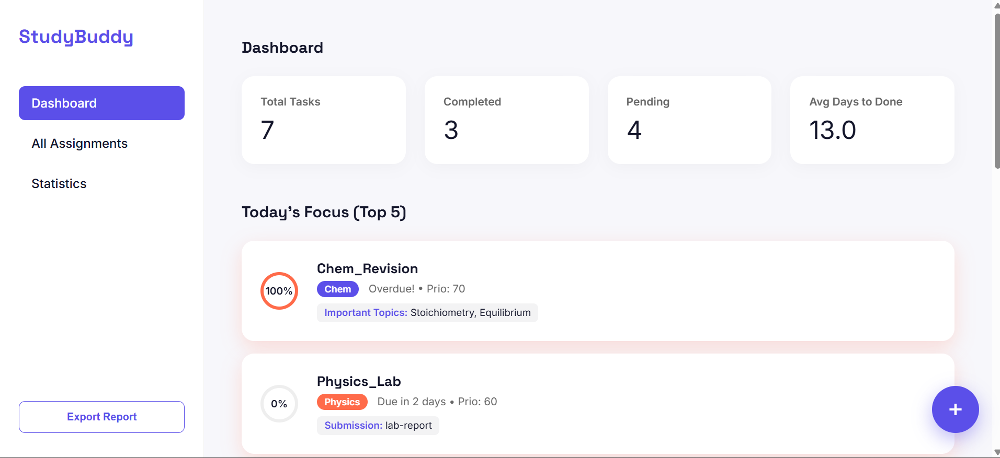
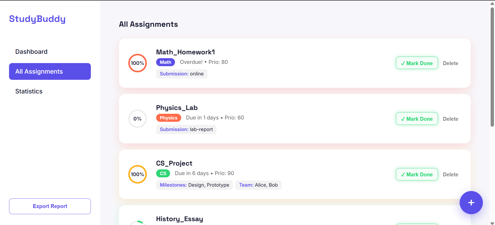
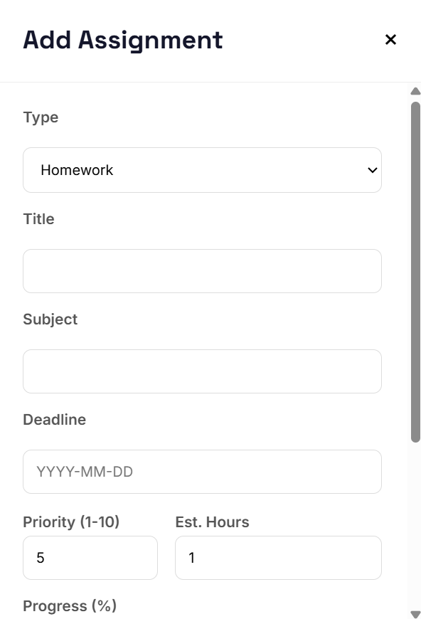
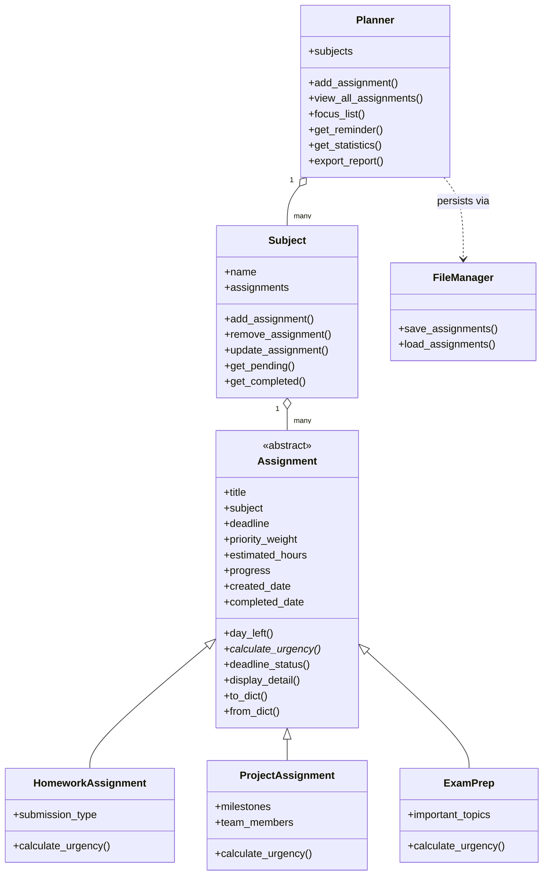

# 📚 StudyBuddy — Assignment & Deadline Tracker

> A Python OOP–based academic productivity engine that automatically prioritizes your workload by urgency, tracks progress across subjects, and exports actionable study reports.


StudyBuddy is a command-line assignment tracker built to demonstrate solid object-oriented design in Python — abstraction, inheritance, polymorphism, encapsulation via properties, and a custom exception hierarchy — while solving a genuinely useful problem: **what should I work on next?**

Instead of a flat to-do list, every assignment type calculates its own **urgency score** using a formula tailored to how that kind of work actually behaves under deadline pressure. The planner then uses that score to drive focus lists, reminders, and reports.

---

## Table of Contents

- [Overview](#overview)
- [Screenshots](#screenshots--demo)
- [Features](#features)
- [Architecture](#architecture)
- [Project Structure](#project-structure)
- [The Urgency Algorithm](#the-urgency-algorithm)
- [Installation](#installation)
- [Usage](#usage)
- [Data Persistence](#data-persistence)
- [Error Handling](#error-handling)
- [Roadmap](#roadmap)
- [Contributing](#contributing)
- [License](#license)
- [Author](#author)

---


## Screenshots





---

## Overview

StudyBuddy models three kinds of academic work as subclasses of a single abstract `Assignment`:

| Type | Represents | Unique Fields |
|---|---|---|
| **HomeworkAssignment** | Standard homework/assignments | `submission_type` |
| **ProjectAssignment** | Multi-person, milestone-based work | `milestones`, `team_members` |
| **ExamPrep** | Study/revision for an exam | `important_topics` |

Each subclass overrides `calculate_urgency()` with logic suited to its nature — homework urgency scales with remaining work per day, project urgency also factors in effort load, and exam prep urgency spikes sharply as the deadline approaches. Assignments are grouped under `Subject`s and orchestrated by a central `Planner`, which powers focus lists, reminders, and completion statistics. Data is persisted to JSON between sessions.

---

## Features

- 🧠 **Polymorphic urgency scoring** — each assignment type defines its own prioritization formula
- 📁 **Subject-based organization** — assignments are automatically grouped by subject
- 🎯 **Focus List** — instantly surface the top N most urgent tasks
- ⏰ **Reminders** — flag anything due within a configurable window
- 📊 **Statistics** — completion rate per subject, average completion time, pending vs. done
- 📤 **Report export** — human-readable `.txt` report of all assignments + stats
- ✅ **Flexible deadline parsing** — accepts both `YYYY-MM-DD` and `DD-MM-YYYY`
- 🛡️ **Custom exception hierarchy** — every invalid input fails with a specific, descriptive error
- 💾 **Zero external dependencies** — pure Python standard library (`datetime`, `json`, `abc`)

---

## Architecture

The codebase follows a clean layered separation: **domain models → orchestration → persistence → CLI**.



- **Model layer** (`models/`) — `Assignment` (ABC) and its subclasses, plus `Subject`. All fields are validated through Python properties, raising domain-specific exceptions on bad input.
- **Orchestration layer** (`planner.py`) — `Planner` owns all subjects, computes cross-subject views (focus list, reminders, stats), and never touches raw dicts — only `Assignment` objects.
- **Persistence layer** (`file_manager.py`) — serializes/deserializes assignments to/from `data/assignments.json`, dispatching to the correct subclass via a type-name map.
- **CLI layer** (`main.py`) — a menu-driven interface that wires user input to `Planner` methods and catches `StudyBuddyError` subclasses for friendly error messages.

---

## Project Structure

```
StudyBuddy/
├── main.py                  # CLI entry point & menu loop
├── planner.py                # Planner — core orchestration logic
├── file_manager.py           # JSON persistence layer
├── exceptions.py             # Custom exception hierarchy
├── debug_load.py             # Dev utility to inspect loaded data
├── models/
│   ├── assignment.py         # Assignment ABC + 3 concrete subclasses
│   └── subject.py            # Subject — groups assignments
├── data/
│   └── assignments.json      # Persisted assignment records
├── reports/
│   └── study_report.txt      # Generated export output
└── README.md
```

---

## The Urgency Algorithm

This is the core intelligence of the app. Every assignment type answers "how urgent am I?" differently:

| Type | Formula (while time remains) | If overdue / due today |
|---|---|---|
| **Homework** | `priority_weight + (100 − progress) / days_left` | `∞` |
| **Project** | `priority_weight + ((100 − progress) / days_left) × (estimated_hours / days_left)` | `∞` |
| **Exam Prep** | `priority_weight + (1 / days_left)²` | `∞` |

**Why they differ:**
- **Homework** scales linearly with leftover work per day — a straightforward workload-vs-time ratio.
- **Projects** additionally weight in `estimated_hours`, so large, effort-heavy projects escalate faster than small ones as the deadline closes in.
- **Exam Prep** has no "progress" term by design — urgency accelerates sharply (quadratically) purely as a function of time remaining, reflecting that studying is rarely "linearly complete."
- Anything **overdue or due today** is assigned `float('inf')`, guaranteeing it sorts to the top of every list.

`Planner.view_all_assignments()` sorts every assignment across all subjects by this score in descending order — that sorted list is what powers the Focus List, Reminders, and the exported report.

---

## Installation

**Requirements:** Python **3.12+** (the codebase uses [PEP 701](https://peps.python.org/pep-0701/) nested-quote f-strings in `ProjectAssignment.display_detail()`, which is a hard requirement, not just a recommendation).

```bash
git clone https://github.com/<your-username>/StudyBuddy-Assignment-Deadline-Tracker.git
cd StudyBuddy-Assignment-Deadline-Tracker

# Required output directories aren't auto-created yet — set them up once:
mkdir -p data reports

python main.py
```

No `pip install` needed — the project has zero third-party dependencies.

---

## Usage

Launch `main.py` and you'll get an interactive menu:

```
1. Add Assignment
2. View All Assignments
3. Update Assignment
4. Remove Assignment
5. Today's Focus List
6. Reminders (due soon)
7. Statistics
8. Export Report
9. Exit
```

**Typical flow:**
1. **Add Assignment** — choose Homework / Project / Exam Prep, then fill in title, subject, deadline, priority weight (0–100), estimated hours, and progress.
2. **View All Assignments** — see everything, sorted automatically by urgency.
3. **Today's Focus List** — the top 5 most urgent tasks across all subjects.
4. **Reminders** — anything due within 2 days, flagged with an alert.
5. **Export Report** — writes a full snapshot to `reports/study_report.txt`.

Sample export output:

```
Title: Math_Homework1
Subject: Math
Type: HomeworkAssignment
Deadline: 2026-08-14(due in 1 days)
Urgency: 140.0
Progress: 40%
Submission Type: online
----------------------------------------
<<<<<<<<-------Statistics------->>>>>>>>>
total : 5
completed : 0
pending : 5
avg_completion_time_days : 0
completion_rates : {'math': 0.0, 'cs': 0.0, ...}
```

---

## Data Persistence

Assignments are stored as JSON in `data/assignments.json`. Each object records its concrete `type`, so `FileManager` can reconstruct the correct subclass on load:

```json
{
  "title": "Math_Homework1",
  "subject": "Math",
  "type": "HomeworkAssignment",
  "deadline": "2026-08-14",
  "priority_weight": 80,
  "estimated_hours": 3,
  "progress": 40,
  "created_date": "2026-08-10",
  "completed_date": null,
  "submission_type": "online"
}
```

Progress reaching `100` automatically stamps `completed_date`, which feeds the average-completion-time statistic.

---

## Error Handling

All validation is enforced at the property level and surfaces as specific, catchable exceptions (all rooted in `StudyBuddyError`, except `InvalidType`/`TitleError` which are standalone):

| Exception | Raised When |
|---|---|
| `InvalidType` | A field receives the wrong data type |
| `TitleError` | Title is empty |
| `SubjectNotFound` | Subject name is empty, or lookup fails for an unknown subject |
| `WrongDeadlineError` | Deadline doesn't match either supported format, or has a non-4-digit year |
| `InvalidPriority` | `priority_weight` is outside 0–100 |
| `InvalidHour` | `estimated_hours` is ≤ 0 |
| `InvalidProgress` | `progress` is outside 0–100 |
| `AssignmentNotFound` | No assignment with the given title exists under that subject |

The CLI catches all of these centrally in `main.py` and prints a clean `Error: ...` message instead of a stack trace.

---

## Roadmap

- [ ] **Web application** — Flask REST API + HTML/CSS/JS frontend on top of the existing model layer (in active development)
- [ ] Auto-create `data/` and `reports/` directories on startup
- [ ] Automated test suite (`pytest`) covering urgency formulas and validation edge cases
- [ ] Fix known return-path bug in `Subject.get_completed()`
- [ ] Packaging as an installable CLI (`pip install studybuddy`)
- [ ] Optional multi-user support

---

## Contributing

Contributions are welcome:

1. Fork the repository
2. Create a feature branch (`git checkout -b feature/your-feature`)
3. Commit your changes with clear messages
4. Open a pull request describing the change and rationale

Please keep new assignment types consistent with the existing pattern: extend `Assignment`, implement `calculate_urgency()`, and update `to_dict()` / `from_dict()` and `file_manager.py`'s type map.

---

## License

No license file is currently included. Until one is added, all rights are reserved by default — consider adding an [MIT](https://choosealicense.com/licenses/mit/) or similar permissive license if you'd like others to use or contribute to this project.

---

## Author

**Talha** — Student, on the journey to becoming an AI Engineer.
